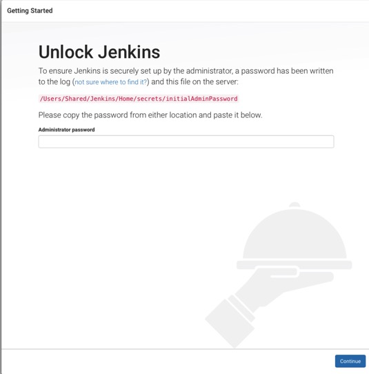
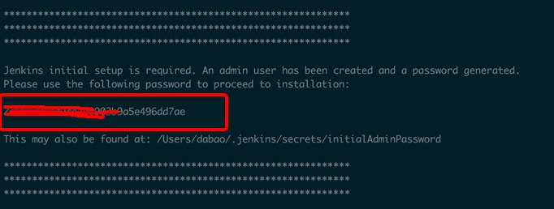
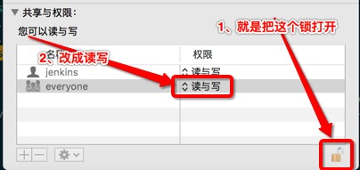

title: Jenkins
date: 2017-09-01 10:49:04
tags:
category: Jenkins
---

Jenkins相关集成
<!-- more -->
<The rest of contents | 余下全文\>
# 安装
```
brew install jenkins
```
> 到这一步都说安装成功了，但是我在**Users/dabao/Shared/**
压根没找到jenkins目录，所以还是老老实实在官网下载[Jenkins](https://jenkins.io/)安装吧，你就会发现在shared下面已经有了jenkins的文件。

# 运行
* 当你安装完成后，就就自动开发浏览器，并且打开的是http://localhost:8080，
> 这里又有个坑，就是会出现下图的情况，



> 其实把如果用brew安装会有下图的key


> 但是我没看到，或者我用apk安装的，那我们可以去找到/Users/Shared/Jenkins/Home/secrets 这个目录下，不用想这个目录没有权限打开，那我们可以右键->显示简介->共享与权限。如下图的操作



> 开发initialAdminPassword，是的，你没有看错，就是打不开，还是权限问题，按照上面的做一遍，你就可以拿到key了，填到浏览器里面，就开始安装了，等着吧

# 剩下的其他blog多了去了，我想大部分初入Jenkins都遇到我说的这种情况
