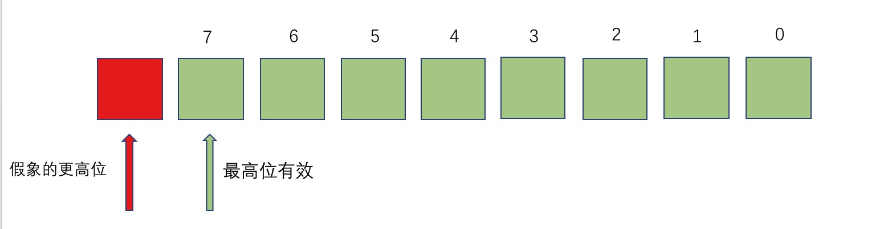

title: 逆向工程_状态寄存器
date: 2018-07-09 22:11:02
tags: 逆向
category:
---

状态寄存器以及循环&选择介绍
<!-- more -->
<The rest of contents | 余下全文\>


# 状态寄存器
&emsp;&emsp;&ensp;CPU内部的寄存器中,有一种特殊的寄存器(对于不同的处理器,个数和结构都可能不同).这种寄存器在ARM中,被称为状态寄存器就是CPSR(current program status register)寄存器
CPSR和其他寄存器不一样,其他寄存器是用来存放数据的,都是整个寄存器具有一个含义.而CPSR寄存器是按位起作用的,也就是说,它的每一位都有专门的含义,记录特定的信息.
>注:CPSR寄存器是32位的

* CPSR的低8位（包括I、F、T和M[4：0]）称为控制位，程序无法修改,除非CPU运行于特权模式下,程序才能修改控制位!
* N、Z、C、V均为条件码标志位。它们的内容可被算术或逻辑运算的结果所改变，并且可以决定某条指令是否被执行!意义重大!


### N（Negative）标志
>CPSR的第31位是 N，符号标志位。它记录相关指令执行后,其结果是否为负.如果为负 N = 1,如果是非负数 N = 0.

&emsp;&emsp;&ensp;**注意**,在ARM64的指令集中,有的指令的执行时影响状态寄存器的,比如add\sub\or等,他们大都是运算指令(进行逻辑或算数运算)；


### Z(Zero)标志
>CPSR的第30位是Z，0标志位。它记录相关指令执行后,其结果是否为0.如果结果为0.那么Z = 1.如果结果不为0,那么Z = 0.

&emsp;&emsp;&ensp;对于Z的值,我们可以这样来看,Z标记相关指令的计算结果是否为0,如果为0,则N要记录下"是0"这样的肯定信息.在计算机中1表示逻辑真,表示肯定.所以当结果为0的时候Z = 1,表示"结果是0".如果结果不为0,则Z要记录下"不是0"这样的否定信息.在计算机中0表示逻辑假,表示否定,所以当结果不为0的时候Z = 0,表示"结果不为0"。

### C(Carry)标志
>CPSR的第29位是C，进位标志位。一般情况下,进行**无符号数**的运算。
>加法运算：当运算结果产生了进位时（无符号数溢出），C=1，否则C=0。
>减法运算（包括CMP）：当运算时产生了借位时（无符号数溢出），C=0，否则C=1。

&emsp;&emsp;&ensp;对于位数为N的无符号数来说，其对应的二进制信息的最高位，即第N - 1位，就是它的最高有效位，而假想存在的第N位，就是相对于最高有效位的更高位。如下图所示：




### 进位
&emsp;&emsp;&ensp;我们知道，当两个数据相加的时候，有可能产生从最高有效位向更高位的进位。比如两个32位数据：0xaaaaaaaa + 0xaaaaaaaa,将产生进位。由于这个进位值在32位中无法保存，我们就只是简单的说这个进位值丢失了。其实CPU在运算的时候，并不丢弃这个进位制，而是记录在一个特殊的寄存器的某一位上。ARM下就用C位来记录这个进位值。比如，下面的指令

```
mov w0,#0xaaaaaaaa；0xa 的二进制是 1010
adds w0,w0,w0； 执行后 相当于 1010 << 1 进位1（无符号溢出） 所以C标记 为 1
adds w0,w0,w0； 执行后 相当于 0101 << 1 进位0（无符号没溢出） 所以C标记 为 0
adds w0,w0,w0； 重复上面操作
adds w0,w0,w0
```
### 借位
&emsp;&emsp;&ensp;当两个数据做减法的时候，有可能向更高位借位。再比如，两个32位数据：0x00000000 - 0x000000ff,将产生借位，借位后，相当于计算0x100000000 - 0x000000ff。得到0xffffff01 这个值。由于借了一位，所以C位 用来标记借位。C = 0.比如下面指令：

```
mov w0,#0x0
subs w0,w0,#0xff ;
subs w0,w0,#0xff
subs w0,w0,#0xff
```

### V(Overflow)溢出标志  
>CPSR的第28位是V，溢出标志位。在进行有符号数运算的时候，如果超过了机器所能标识的范围，称为溢出。

* 正数 +  正数  为负数  溢出
* 负数 +  负数  为正数  溢出
* 正数 +  负数  不可能溢出


## 指令介绍
#### bl指令
* 跳转，将下一条执行的指令放入lr（X30）寄存器

#### ret
* 返回到lr寄存器所保存的地址 执行代码

#### lr 寄存器
* 保存子程序返回地址

#### pc 寄存器
* 指向马上要执行的代码地址


#### sp
* 指向了我们栈
* 栈平衡（每个函数调用完毕之后，将拉伸的栈空间平衡（将sp加回去））


* 函数调用会开辟一段空间（栈空间）
* 函数的局部变量、参数、寄存器的保护

> 参数：x0 -- x7(个数有关系、数据类型也有关)
	多余的就会入栈


> 函数嵌套调用：
	| - A(开辟) --> B（开辟） --> A（开辟）
	| -  A<-->A 死的递归（内存溢出）

#### adrp

* 是计算指定的数据地址 到当前PC值的相对偏移
由于得到的结果是低12bit为0

```
adrp   x0, 1
adrp
10 1024
12  == 4KB
```

1. 将1的值,左移12位 1 0000 0000 0000 == 0x1000
2. 将PC寄存器的低12位清零 0x1002e6874  ==> 0x1002e6000
3. 将将1 和 2 的结果相加  给 X0 寄存器!!


## 内存分区域
* 代码区  特点: 可读可写可执行
* 栈区域  放参数和局部变量
* 堆区域 动态申请 可读可写
* 全局:  可读可写
* 常量区: 只读!


# 循环&选择
## cmp（Compare）比较指令
&emsp;&emsp;&ensp;CMP 把一个寄存器的内容和另一个寄存器的内容或立即数进行比较。但不存储结果，只是正确的更改标志。
&emsp;&emsp;&ensp;一般CMP做完判断后会进行跳转，后面通常会跟上B指令！

* BL 标号：跳转到标号处执行
* B.GT  标号：比较结果是**大于（greater than）**，执行标号，否则不跳转
* B.GE  标号：比较结果是**大于等于（greater than or equal to）**，执行标号，否则不跳转
* B.EQ  标号：比较结果是**等于**，执行标号，否则不跳转
* B.HI  标号：比较结果是**无符号大于**，执行标号，否则不跳转

## Switch
1、假设switch语句的分支比较少的时候（例如3，少于4的时候没有意义）没有必要使用此结构，相当于if。
2、各个分支常量的差值较大的时候，编译器会在效率还是内存进行取舍，这个时候编译器还是会编译成类似于if，else的结构。
3、在分支比较多的时候：在编译的时候会生成一个表（跳转表每个地址四个字节）。
